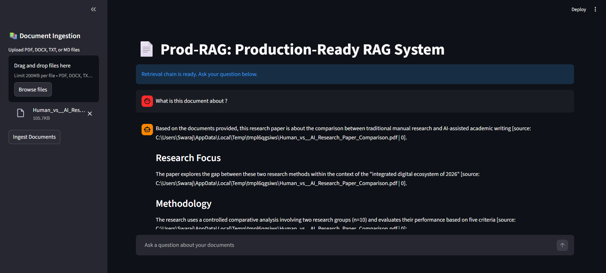
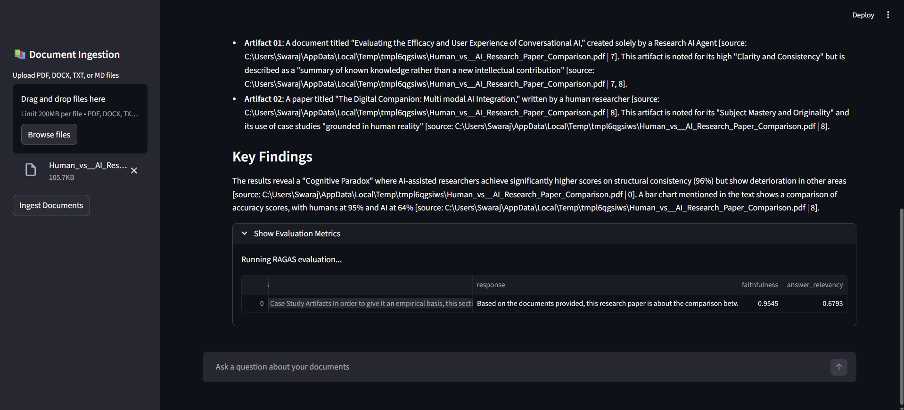
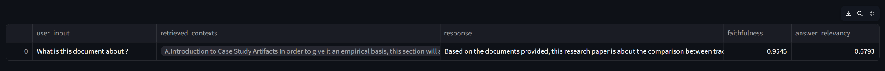

# Prod-RAG

## Project Overview

Prod-RAG is a production-grade Retrieval-Augmented Generation (RAG) system designed for high-precision domain-specific question answering. The architecture implements a hybrid retrieval strategy combining sparse and dense vector search, refined by a cross-encoder reranking step. The system enforces strict citation requirements in generated responses, integrates automated evaluation using Ragas, and includes observability through Langfuse for tracing prompts, token usage, latency, and cost across the pipeline.

## Technical Architecture

The application follows a modular pipeline architecture:

1.  **Ingestion Layer**: Handles multi-format document loading (PDF, DOCX, TXT, MD) and normalization.
2.  **Processing Layer**: Implements recursive character text splitting to optimize context window usage.
3.  **Storage Layer**: Utilizes ChromaDB for vector storage with persistent on-disk serialization.
4.  **Retrieval Layer**: Executes a hybrid search strategy:
    *   **Sparse Retrieval**: BM25 algorithm for keyword matching.
    *   **Dense Retrieval**: Vector similarity search using Google Generative AI embeddings.
    *   **Fusion**: Reciprocal Rank Fusion (RRF) to normalize and combine results from sparse and dense retrievers.
5.  **Reranking Layer**: Applies a cross-encoder model (Cohere) to re-score retrieved documents based on semantic relevance to the query.
6.  **Generation Layer**: Uses Google Gemini models with a strict system prompt to generate evidence-based answers with mandatory citations.
7.  **Evaluation Layer**: Real-time assessment of generated responses using Ragas metrics.
8.  **Observability Layer**: Integrates Langfuse to trace the RAG pipeline, tracking prompts, tokens used, LLM calls, latency, and input/output costs for full system monitoring.

## Technology Stack

*   **Language**: Python 3.13.1
*   **Orchestration Framework**: LangChain
*   **Interface**: Streamlit
*   **Vector Database**: ChromaDB
*   **LLM Provider**: Google Gemini 
*   **Embedding Model**: Google Generative AI Embeddings
*   **Reranking Service**: Cohere
*   **Evaluation Framework**: Ragas
*   **Observability & Tracing**: Langfuse
*   **Document Processing**: `pypdf`, `docx2txt`, `unstructured`

## System Configuration

The system is configured with the following specific parameters to balance performance and accuracy:

### Text Processing
*   **Chunking Strategy**: `RecursiveCharacterTextSplitter`
*   **Chunk Size**: 800 characters
*   **Chunk Overlap**: 150 characters

### Retrieval & Reranking
*   **Hybrid Fusion**: RRF (Reciprocal Rank Fusion)
*   **Reranker Model**: `rerank-english-v3.0` (Cohere)
*   **Rerank Top N**: 5 documents
*   **Retrieval Top K**: 10 documents (pre-rerank)

### Generation
*   **Model**: Google Gemini 
*   **System Prompt**: Versioned YAML configuration enforcing citation format `[source: filename | chunk_id]`.

### Evaluation (RAGAS)
The system implements the following metrics for every generated response:

1.  **Faithfulness**: Measures the factual consistency of the generated answer against the retrieved context.
2.  **Answer Relevancy**: Measures how pertinent the generated answer is to the user's query.

### Observability
The system integrates Langfuse to provide full observability across the RAG pipeline.

Langfuse is used to monitor and trace:

- LLM prompts and responses
- Retrieval results and context passed to the model
- Input tokens and output tokens
- Number of LLM calls per request
- Input cost, output cost, and total cost of each generation
- Latency for individual model calls and overall request execution
- End-to-end traces across the full RAG pipeline

This observability layer enables detailed debugging, performance monitoring, and cost tracking for the production RAG workflow.

## Application Interface

## Demo

[](https://www.youtube.com/watch?v=qBCJLr9mp2A)

Click to watch the video
---

## Main Interface



---

## RAGAS Evaluation Metrics





## Installation and Execution

### Prerequisites
*   Python 3.10+
*   Google AI Studio API Key
*   Cohere API Key

### Setup

1.  **Clone the repository**:
    ```bash
    git clone https://github.com/swaraj-khan/Prod-RAG.git
    cd Prod-RAG
    ```

2.  **Install dependencies**:
    ```bash
    pip install -r requirements.txt
    ```

3.  **Configure Environment**:
    Ensure environment variables are present:
    *   `GOOGLE_API_KEY`
    *   `COHERE_API_KEY`
    *   `LANGFUSE_SECRET_KEY`
    *   `LANGFUSE_PUBLIC_KEY`
    *   `LANGFUSE_BASE_URL`


4.  **Run the Application**:
    ```bash
    streamlit run main.py
    ```
